# Task 1: Billing Alarm

Billing Alarm Task
Step 1: Create SNS Topic

Created a new SNS Topic to receive billing notifications.

Added my email address subscription to the topic.

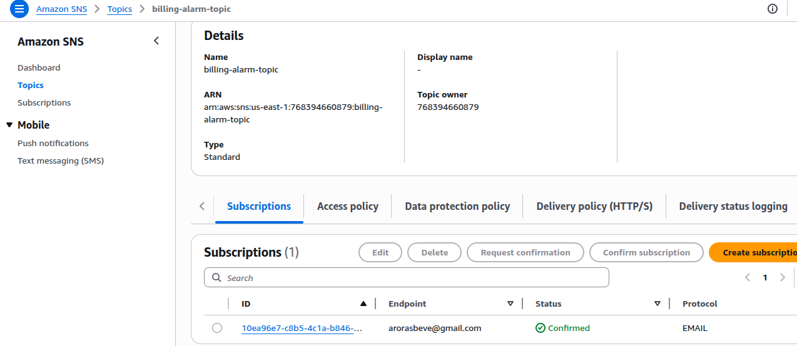

Step 2: Create Billing Alarm

Navigated to CloudWatch → Alarms.

Chose Billing Alarm and set the threshold to $1.

Selected the SNS Topic created earlier for notifications.

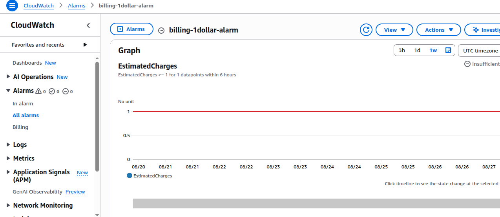

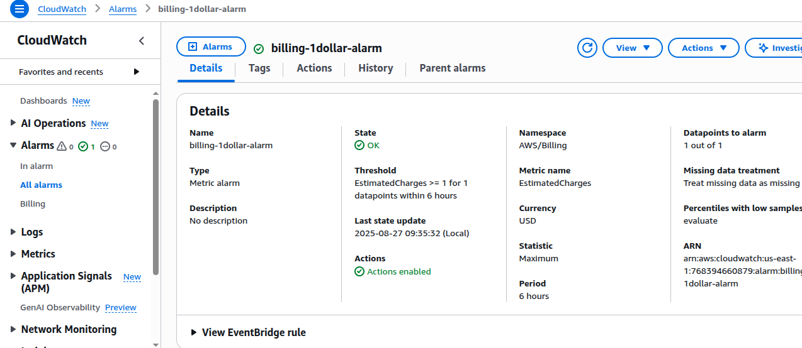


# Task 2: Setup VPC Network with Public and Private EC2 Servers

## Overview
In this task, we will design and deploy a custom VPC on AWS with **public** and **private** subnets.  
We will configure networking components (Internet Gateway, NAT Gateway, and Route Tables) and launch EC2 instances in both subnets.  
The goal is to access the **public web server** directly from the internet and verify connectivity of the **private server** through the NAT/public instance.

---

## VPC Setup
- **VPC CIDR:** `10.0.0.0/16`
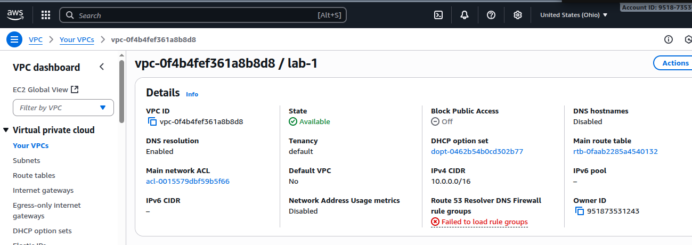

### Subnets
- **Public Subnet 1:** `10.0.0.0/24`
- **Public Subnet 2:** `10.0.1.0/24`
- **Private Subnet 1:** `10.0.2.0/24`
- **Private Subnet 2:** `10.0.3.0/24`
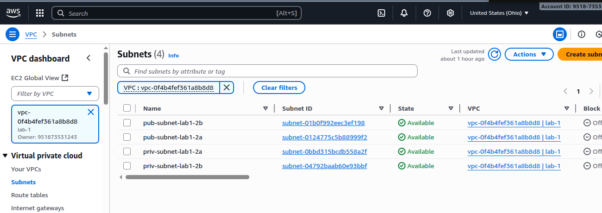

### Internet Gateway (IGW)
- Attach IGW to the VPC.
- Used by **Public Subnets** to connect directly to the internet.
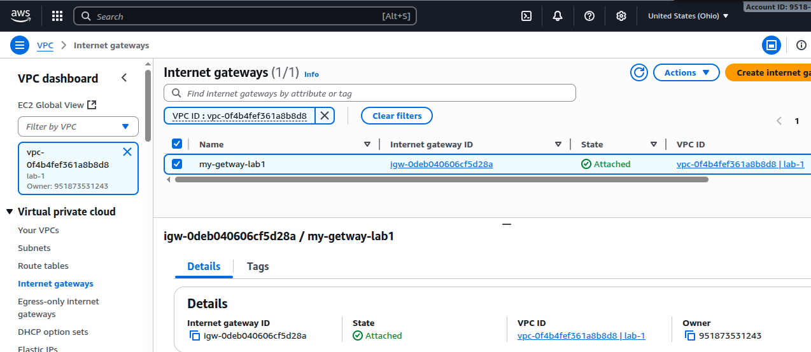

### NAT Gateway (NAT GW)
- Deploy NAT GW in one of the **Public Subnets** with an Elastic IP.
- Used by **Private Subnets** to reach the internet (for updates, packages).
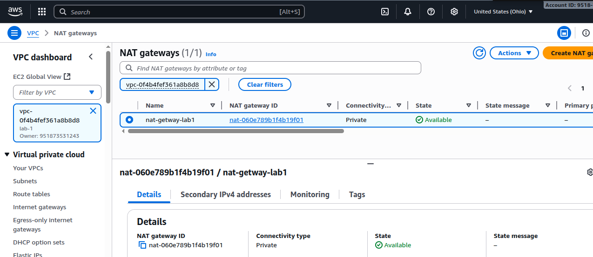

### Route Tables
- **Public Route Table**  
  - Routes:  
    - `10.0.0.0/16` → Local  
    - `0.0.0.0/0` → Internet Gateway  
  - Associated with Public Subnets.


- **Private Route Table**  
  - Routes:  
    - `10.0.0.0/16` → Local  
    - `0.0.0.0/0` → NAT Gateway  
  - Associated with Private Subnets.
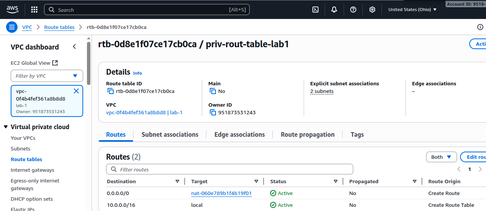


---

## EC2 Instances

### Public EC2 Instance
- **Subnet:** Public Subnet (10.0.0.0/24 or 10.0.1.0/24)  
- **Security Group:**  
  - Inbound:  
    - SSH (22) from your IP  
    - HTTP (80) from anywhere  
  - Outbound: Allow All  
- **User Data Script:** Install and start Apache web server:
  ```bash
  #!/bin/bash
  yum update -y
  yum install -y httpd
  systemctl enable httpd
  systemctl start httpd
  echo "<h1>Hello from Public EC2 Apache Web Server!</h1>" > /var/www/html/index.html
Verification:
Access via browser → http://<Public-IP>
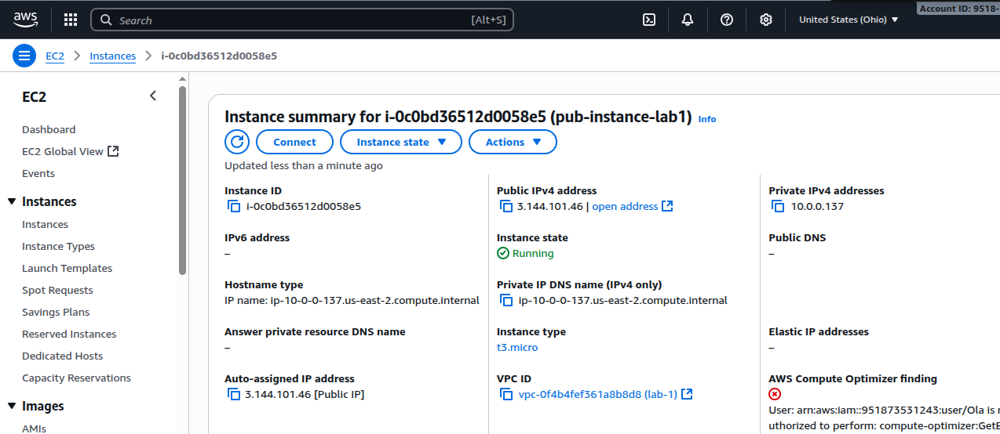

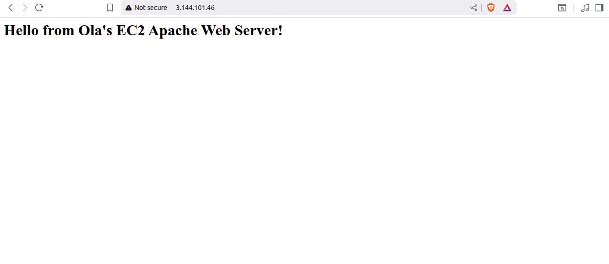

### Private EC2 Instance

- A private EC2 instance was launched inside a private subnet.

- This instance does not have direct Internet access.

- It communicates with the NAT Gateway for outbound connections (e.g., software updates, reaching AWS services).

- Inbound Internet traffic is blocked, ensuring the instance stays isolated and secure.
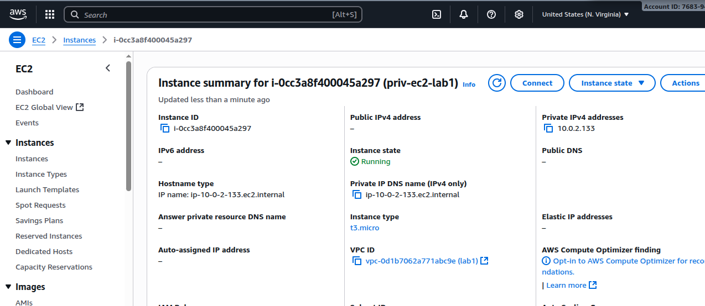
