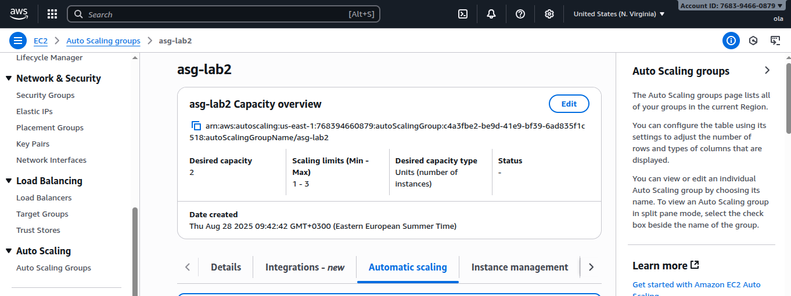
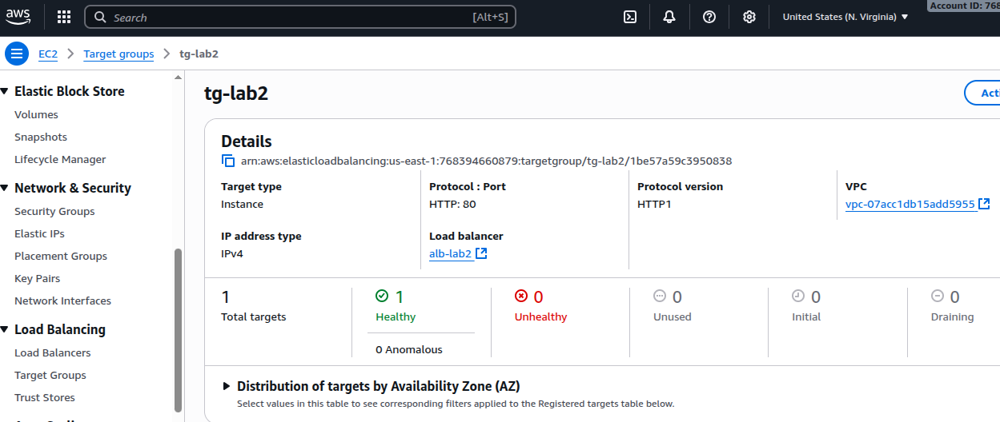

# Task 1: EBS Snapshot and Restore

## Overview

This task demonstrates how to take a snapshot of an EC2 root volume, create a new volume from that snapshot, and use it as the root volume for a new EC2 instance. This allows us to preserve files and configurations from an existing EC2.

---

Steps
## step 1: Launch Original EC2

- Created a t2.micro EC2 instance using Amazon Linux 2023 AMI.

- Copied a test file from local machine to the EC2 (test.txt).


## step 2: Create Snapshot

- Stopped the original EC2.

- Selected the root volume /dev/xvda.

- Created a snapshot of the volume.


## step 3: Create Volume from Snapshot

- From the snapshot, created a new EBS volume in the same Availability Zone as the target EC2.


## step 4: Launch New EC2

- Launched a new t2.micro EC2 in the same AZ.

- Stopped the instance after launch.

## step 5: Replace Root Volume

- Detached the default root volume of the new EC2.

- Attached the volume from the snapshot as /dev/xvda.

## step 6: Start New EC2

- Started the new EC2 instance.

- SSH into the EC2 and verified the test file exists.


# Task 2: Load Balancing and Auto Scaling

## Overview
Setup EC2 Auto Scaling with a Launch Template, attached to an Application Load Balancer (ALB).  
Goal: Distribute traffic and scale instances based on CPU usage.

---

## Step 1: Launch Template
- Created Launch Template `lt-lab2` with:
  - **AMI:** Amazon Linux 2023
  - **Instance Type:** t2.micro
  - **Security Group:** pub-sg-lab2
  - **User Data:** Installs Apache and prints hostname/IP
- Enabled **Auto-assign Public IP**

```bash
#!/bin/bash
yum update -y
yum install -y httpd
systemctl enable httpd
systemctl start httpd
echo "<h1>Hello from Apache Web Server on $(hostname -f)</h1>" > /var/www/html/index.html
```


## Step 2: Auto Scaling Group (ASG)
- Created ASG asg-lab2 using lt-lab2

- Subnets: 10.0.0.0/24, 10.0.1.0/24

- Capacity: Min 1, Desired 1, Max 3

- Added CPU 50% target tracking scaling policy




## Step 3: Application Load Balancer
- Created ALB alb-lab2 with target group tg-lab2 attached to ASG

- Health check: HTTP /, success code 200




## Step 4: Verification
- Access ALB DNS in browser to see Apache page

- Run CPU stress test on EC2 to trigger auto-scaling:


---
