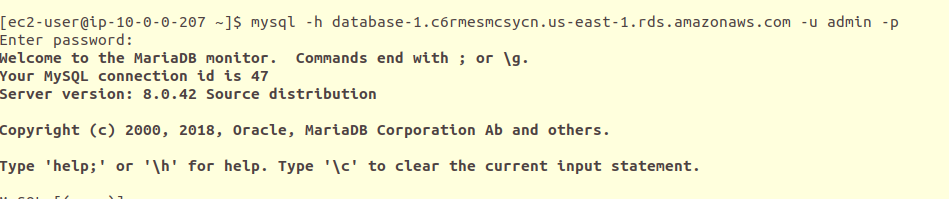

# Task 1: IAM + S3

## Overview

In this task, we worked on creating an AWS S3 bucket and managing access for different IAM users. The goal was to test user permissions by uploading and listing objects inside a specific folder (marketing/) in the S3 bucket iti-lab3-task1.

## Step 1: Create an S3 bucket

- Created an S3 bucket named iti-lab3-task1 from the AWS Management Console.

## Step 2: Create IAM users

- Created IAM users (marketing-user & developer-user).

- Configured access keys for programmatic access.

## Step 3: Create and attach IAM policy

- Wrote a custom policy to allow the user access to the marketing/ folder inside the S3 bucket.

- Attached the policy to the group users.

## Step 4: Configure AWS CLI locally

- Installed and configured AWS CLI with the credentials of marketing-user using the command:

- aws configure --profile marketing-user

## step 5: Verification (Testing Permissions)
**For Marketing user**

**For Developer user**

# Task 2: Connect to RDS from EC2

## Overview

This project demonstrates how to provision an Amazon RDS MySQL instance and connect to it securely from an EC2 instance within the same VPC. 

## Step 1: Create RDS Instance (MySQL)

- Go to AWS RDS console and create a MySQL DB instance.

- Save the endpoint, username, and password.

## Step 2: Create EC2 Instance

- Launch a new EC2 instance (Amazon Linux preferred).

- Attach an IAM Role with RDS access permissions.

## Step 3: Configure Security Groups

- Edit the RDS security group.

- Allow inbound traffic on port 3306 from the EC2 instance's security group

## Step 4: Install MySQL Client on EC2

## Step 5: Connect to RDS from EC2

## Step 6: Verify Connection

